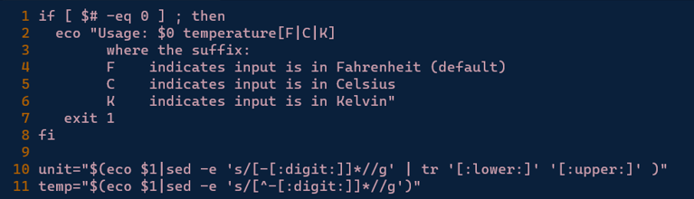
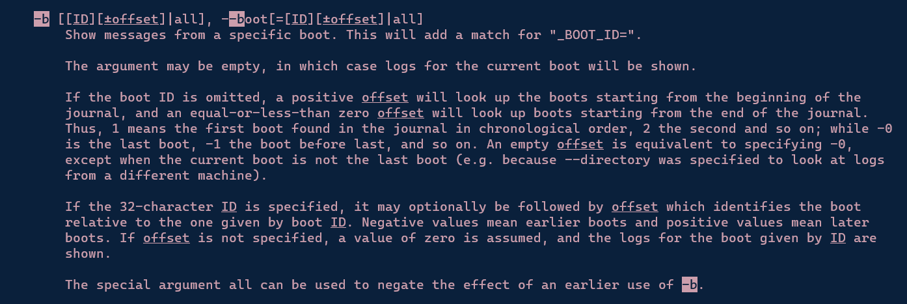
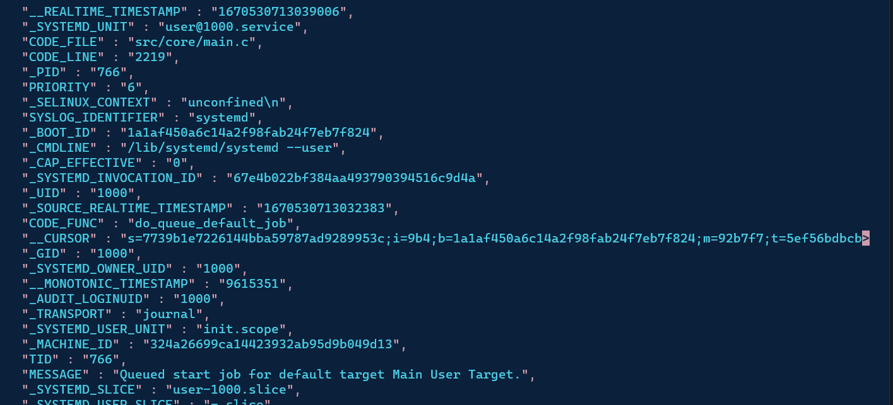

## 2420 Linux System Administration Final Exam

### Part 1
Use the following code to update software on Ubuntu OS

    sudo apt upgrade
    sudo apt update

### Part 2

Created the file 

```
vim part2
esc + : + set number to show line numbers
enter + line number + shift g to move to the different lines
/V to jump to the line 2 where V needs to be changed to C
/V to jump to line 5 where it needs to be changed to C
/digit to jump to line 10 to change numb to digit

```



### Part 3

```
man journalctl
```
within the journalctl man page, use

```
/-b
```


```
/output
```


```
journalctl -b --output=json-pretty -p 4
```


### Part 4

```
#!/bin/bash

USR=`grep /etc/passwd -e x:[1-5][0-9][0-9]`
LISTUSR=($USR)
echo "Regular users on the system are:"
  for user in [$LISTUSR]??? <- for loop here :>

```

### Part 5


The service file is located in /etc/systemd/system.

Service File:
```
[Unit]
Description=Create file to greet Bob

[Service]
Type=oneshot
ExecStart=/bin/bash -c 'echo "hi Bob" > /home/vagranthi-bob'

[Install]
WantedBy=multi-user.target
```

### Part 6


(Please ignore the part where I forgot to systemctl 🙏)

```
[Unit]
Description=Create file to greet Bob
Requires=part5.service

[Timer]
OnBootSec=1min
OnUnitActiveSec=1d

[Install]
WantedBy=timers.target
```
